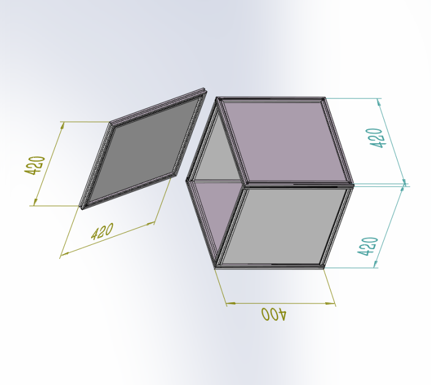

# behavior_box
## Project:
Behavior box is a sound proof box for small animal(mouse, rat, marmoset, etc.) behavior task (especially auditory task) and electrical experiment, fiberphotometry recording.

## Description:
Behavior box incudes the structure and design of sound proof box for small animal behavior investigation. People can build a sound proof box base on this project for small animal behavior task training and recording  various physiological signals, such as electrophysiology and biofluorescence. This designation is publish in “Sensory-to-Category Transformation via Dynamic Reorganization of Ensemble Structures in Mouse Auditory Cortex”(2019) and “Causal contributions of parietal cortex to perceptual decision-making during stimulus categorization”(2019). 

## Contents:
### inner box design

### out box design

### overall

## Credits:
This repository was created by Jingwei Pan and maintained by Ninglong Xu group at Center for Excellence in Brain Science and Intelligence Technology (CEBSIT), Institute of Neuroscience(ION), Chinese Academy of Sciences. 

Behavior box is a complete open-source project, we encourage people to use, test, modify and further develop base on this project. If you have any questions or suggestionss, please contact us or submit an issue. And please cite us!
